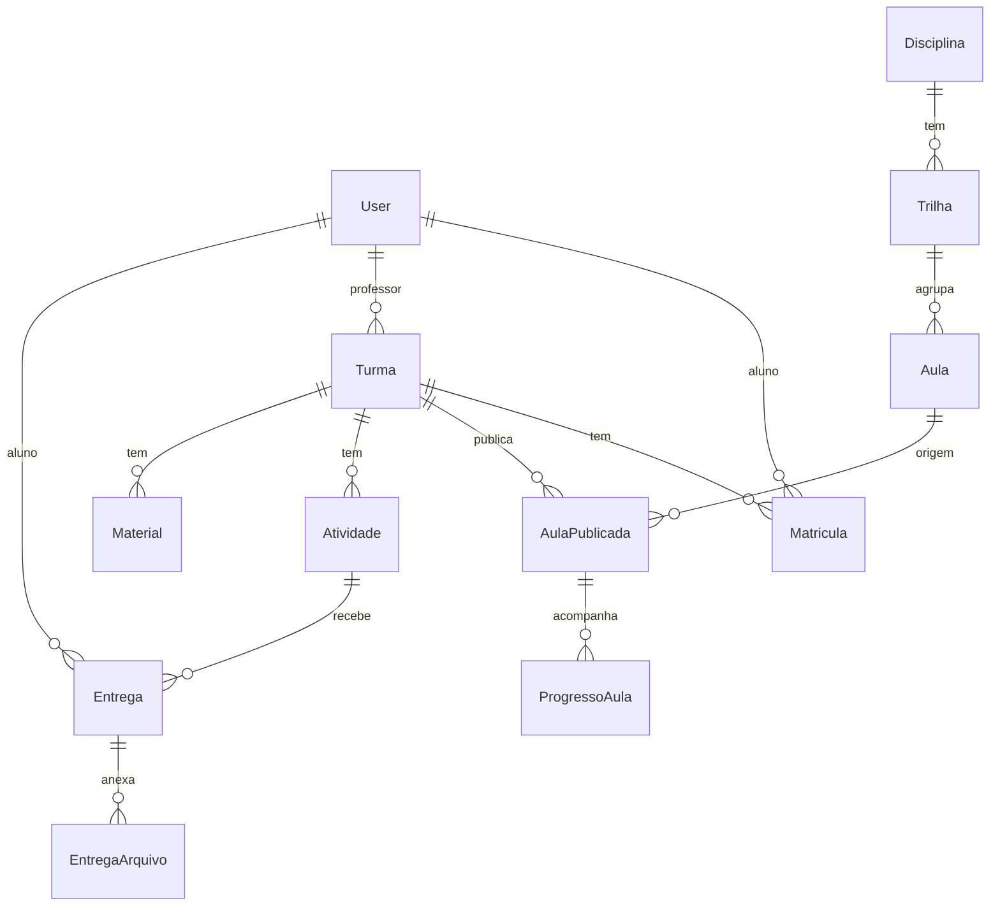

# PRD — Prof. Toni Coimbra (Portal do Aluno)

> Documento de Requisitos de Produto. Guia oficial do desenvolvimento do portal educacional Prof. Toni Coimbra: a ponte entre o acervo de conhecimento do Prof. Toni Coimbra e o aluno.

---

## 1. Visão Geral

**Prof. Toni Coimbra** é um portal educacional moderno onde o conhecimento construído no acervo PROF-TONI (aulas canônicas) chega ao aluno. O professor publica aulas por turma, cria atividades e corrige entregas; o aluno acessa aulas, faz atividades, entrega materiais e acompanha seu progresso.

Inspiração: melhores portais educacionais do mundo (Google Classroom, Khan Academy, Coursera, Canvas, Notion for Education) — impactante, moderno, fluido, focado na jornada do aluno.

### 1.1 Objetivo do produto

Ser a camada de **entrega ao aluno** do pipeline do segundo cérebro:

```
lake (bruto) → curadoria (skill prof-toni + rubrica) → warehouse (canonica.md) → SAÍDA: Prof. Toni Coimbra
```

A `canonica.md` é a fonte de verdade. O Prof. Toni Coimbra **consome** o acervo — não o reescreve.

### 1.2 Personas

| Persona              | Quem é                                                   | Faz                                                                                                |
| ----------------------| ----------------------------------------------------------| ----------------------------------------------------------------------------------------------------|
| **Professor** (Toni) | Dono do conteúdo, SEED-PR                                | Cria turmas, matricula alunos, publica aulas, cria atividades, dá check/nota/feedback nas entregas |
| **Aluno**            | 14–18 anos, Curso Técnico em Desenvolvimento de Sistemas | Acessa aulas da sua turma, estuda, faz atividades, entrega materiais, vê notas e progresso         |
| **Admin**            | Toni (mesmo)                                             | Gestão total via Django Admin                                                                      |

### 1.3 Decisões de produto (definidas)

- **Tenancy:** Single-tenant. Uma instalação para o Prof. Toni (SEED-PR). Sem isolamento por escola. Simplicidade total.
- **Pipeline de aulas:** **Os dois** — importação automática do acervo (`canonica.md` / HTML) **e** upload manual de materiais extras por turma/aula.
- **Infra:** **Simplificada** — Django + PostgreSQL + Docker Compose + reverse proxy (Caddy). Sem Swarm, sem Celery/RabbitMQ/Redis-broker.
- **IA:** **Nenhuma por enquanto.** Foco no core. IA fica para fase futura (removidos Celery, broker, Langchain do escopo).

---

## 2. Tech Specs

- Python `>3.13`. Ambiente virtual em `.venv` na raiz. `requirements.txt` sempre atualizado na raiz.
- Framework **Django `>6.0`**.
- **Single-tenant** — sem campos de tenant, sem middleware de separação por corretora. Apenas escopo de visibilidade por turma/matrícula.
- Autenticação: sistema nativo do Django. **Login por email** (não username).
- Disparo de emails: sistema nativo do Django (recuperação de senha, notificação de matrícula). Config no `.env` → `settings.py`.
- Entidades/domínios separados em **apps Django** (uma responsabilidade por app). Apps na raiz do projeto.
  - App principal: **`core`**.
  - App de recursos base/compartilhados: **`base`**.
- Código em **inglês**; aspas simples; PEP8. UI 100% em **português brasileiro**. Timezone `America/Sao_Paulo`.
- Toda tabela/model tem `created_at` e `updated_at` (mixin em `base`).
- **Não implementar testes** (decisão do projeto; rever se virar SaaS).
- Credenciais em `.env` na raiz (gitignored), importadas no `settings.py` via `django-environ`.
- **Um único** `settings.py`.
- Banco: **PostgreSQL**.
- Docker + Docker Compose para rodar local **e** em produção (VPS). **Sem Docker Swarm.**
- **Sem Celery/RabbitMQ/Redis-broker** nesta fase (não há tarefas pesadas/IA). Cache via `LocMemCache` ou Redis simples opcional.
- Sempre que possível, **Class Based Views** e recursos nativos do Django.
- Signals (se houver) em `signals.py` da app correspondente.
- **Reportlab + PyPDF** para relatórios (boletim, relatório de turma) em PDF.
- Pasta `docs/` com documentação sempre atualizada, servida via **MkDocs** (com suporte a mermaid).
- Django command de **carga inicial de dados fakes** (seed): turmas, alunos, aulas importadas, atividades, entregas em datas variadas — para demonstração.
- **Design system** referenciado em `design_system/design-system.html`. Todo design (cores, componentes, tipografia) respeita rigorosamente o design system.
- Proteção de media: arquivos de materiais/entregas servidos **somente** a usuários com permissão (aluno da turma ou professor). Nunca expor media publicamente.

### 2.1 Stack resumido

| Camada | Tecnologia |
|---|---|
| Backend | Django >6.0, Python >3.13 |
| Banco | PostgreSQL |
| Frontend | Django Templates + HTMX + Alpine.js + Tailwind (ou CSS do design system) |
| Render de aula | Markdown → HTML (parser custom dos blocos `:::tipo`) ou HTML standalone importado |
| Static | WhiteNoise |
| Reverse proxy / TLS | Caddy (HTTPS automático via Let's Encrypt) |
| Containers | Docker + Docker Compose |
| Docs | MkDocs + mermaid |
| Relatórios | Reportlab + PyPDF |

---

## 3. Modelo de Domínio

Apps Django e principais models:

### 3.1 App `base`
- `TimeStampedModel` (abstract): `created_at`, `updated_at`. Herdado por todos os models.
- Helpers compartilhados, mixins de permissão, storage protegido de media.

### 3.2 App `accounts` (usuários)
- `User` (custom, `AbstractUser` com `email` como `USERNAME_FIELD`): `role` (`professor` | `aluno` | `admin`), `nome_completo`, `avatar`.
- `ProfessorProfile`: vínculo SEED, disciplinas que leciona.
- `AlunoProfile`: matrícula escolar, série, responsável (opcional), data de nascimento.

### 3.3 App `catalog` (taxonomia do acervo — espelha o manifesto)
- `Disciplina`: `slug`, `label`, `serie`, `status`. (espelha `manifesto.json`)
- `Trilha`: `disciplina` (FK), `slug`, `label`.
- `Aula` (lesson canônica importada):
  - `disciplina` (FK), `trilha` (FK), `ordem` (int), `slug`, `titulo`, `tema`.
  - `objetivos` (JSON), `prerequisitos` (JSON), `modo_origem`.
  - `conteudo_html` (TextField — corpo da canônica renderizado), `conteudo_md` (fonte original).
  - `html_standalone` (FileField opcional — saída da skill `aula-estatica`).
  - `status` (`aprovada` | `planejada` | ...), `versao`, `atualizado_em`, `source_path`.
  - Importadas apenas com `status = aprovada`.

### 3.4 App `classroom` (turmas)
- `Turma`: `nome`, `disciplina` (FK), `serie`, `ano_letivo`, `professor` (FK), `codigo_convite`, `ativa`.
- `Matricula`: `turma` (FK), `aluno` (FK User), `data_matricula`, `status` (`ativa` | `inativa`).
- `AulaPublicada`: vincula `Aula` (catálogo) → `Turma`, com `disponivel_em` (data de liberação), `ordem_na_turma`, `publicada` (bool). É como uma aula do acervo "aparece" para a turma.
- `ProgressoAula`: `aluno`, `aula_publicada`, `visto_em`, `concluido` (bool). Aluno marca conclusão / progresso.

### 3.5 App `materials` (materiais extras)
- `Material`: `turma` (FK, opcional), `aula_publicada` (FK, opcional), `titulo`, `descricao`, `arquivo` (FileField protegido) ou `link_externo`, `tipo` (pdf | slide | link | video | outro), `enviado_por` (FK professor).

### 3.6 App `activities` (atividades e entregas)
- `Atividade`: `turma` (FK), `aula_publicada` (FK, opcional), `titulo`, `enunciado` (markdown→html), `anexos` (M2M Material), `prazo` (datetime), `pontuacao_max`, `permite_entrega_atrasada`, `publicada`.
- `Entrega` (submission): `atividade` (FK), `aluno` (FK), `texto_resposta`, `data_entrega`, `status` (`pendente` | `entregue` | `atrasada` | `corrigida`).
- `EntregaArquivo`: `entrega` (FK), `arquivo` (FileField protegido).
- **Correção (o "check" do professor):** na `Entrega` → `nota`, `feedback`, `corrigido_por`, `corrigido_em`, `checked` (bool). Professor dá check/nota/feedback.

### 3.7 App `notifications`
- `Notificacao`: `usuario` (FK), `titulo`, `mensagem`, `link`, `lida` (bool), `tipo`. In-app (sino no header). Disparada em: nova aula publicada, nova atividade, prazo próximo, entrega corrigida.

### 3.8 Diagrama de relacionamento (resumo)



---

## 4. Requisitos Funcionais

### 4.1 Autenticação e contas
- [x] Login por email + senha.
- [x] Recuperação de senha por email (nativo Django).
- [x] Perfis: professor e aluno com telas e permissões distintas.
- [x] Edição de perfil (nome, avatar, senha).

### 4.2 Landing page
- [ ] Página raiz com apresentação do portal, identidade visual do design system.
- [ ] CTA para login. (Cadastro de aluno é feito pelo professor / por código de convite — não auto-registro aberto, já que é single-tenant SEED.)
- [ ] Responsiva e impactante.

### 4.3 Gestão (professor)
- [x] CRUD de **Turmas** (nome, disciplina, série, ano letivo, código de convite).
- [x] CRUD de **Alunos** + matrícula em turma. Importação de alunos via CSV.
- [ ] CRUD de **Professores** (caso outros profs usem; admin gerencia).
- [x] Matricular/desmatricular aluno em turma.

### 4.4 Catálogo e publicação de aulas
- [x] **Importar aulas do acervo** (Django command — ver §6). Catálogo de aulas aprovadas, navegável por disciplina/trilha/ordem.
- [ ] **Publicar aula em turma**: professor escolhe aulas do catálogo, define data de liberação (`disponivel_em`) e ordem na turma.
- [ ] Despublicar / reordenar aulas da turma.

### 4.5 Experiência do aluno
- [ ] **Dashboard do aluno**: minhas turmas, próximas aulas liberadas, atividades pendentes e prazos, últimas notas.
- [ ] **Visualizar aula**: render rico da `canonica.md` (blocos `:::conceito`, `:::atencao`, `:::dica`, diagramas) fiel ao design system. Navegação anterior/próxima dentro da trilha da turma.
- [ ] **Marcar aula como concluída** (progresso).
- [ ] **Materiais da aula/turma**: baixar arquivos protegidos, acessar links.
- [ ] **Fazer e entregar atividade**: texto + upload de arquivos. Respeita prazo (marca atrasada se permitido).
- [ ] **Ver notas e feedback** das entregas corrigidas.
- [x] **Notificações** in-app.

### 4.6 Correção (professor)
- [ ] Listar entregas por atividade/turma, com status (pendente/entregue/atrasada/corrigida).
- [ ] Abrir entrega: ver texto + baixar arquivos do aluno.
- [x] **Dar check**: lançar nota, escrever feedback, marcar como corrigida. Dispara notificação ao aluno.
- [ ] Visão de "atividades aguardando correção" no dashboard do professor.

### 4.7 Dashboard do professor
- [x] Visão geral: nº de turmas, alunos, atividades, entregas pendentes de correção.
- [x] Gráficos: entregas por turma, taxa de conclusão de aulas, notas médias, prazos próximos.
- [x] Acesso rápido a turmas e correções.

### 4.8 Materiais
- [ ] Upload de materiais por turma e/ou aula (PDF, slides, links, vídeos).
- [ ] Download protegido por permissão (somente turma/professor).

### 4.9 Relatórios
- [x] Boletim do aluno (PDF) — notas por atividade/turma.
- [x] Relatório de turma (PDF/CSV) — matrículas, progresso, médias.

### 4.10 Admin Django
- [ ] Gestão de todas as entidades com filtros (turmas, alunos, aulas, atividades, entregas, materiais, notificações).

---

## 5. Requisitos Não Funcionais

- [ ] **Responsivo** em todos os tamanhos de tela (mobile-first — alunos usam celular).
- [ ] **Seguro**: rotas fechadas por autenticação e papel; aluno só vê suas turmas/aulas/atividades; media protegida (entregas e materiais nunca expostos publicamente).
- [ ] **UI/UX excelente** fiel ao design system; bom contraste; jornadas fluidas. Inspiração nos melhores portais educacionais.
- [ ] **Performance**: filtros e telas rápidos; paginação; `select_related`/`prefetch_related`; nada bloqueante.
- [ ] **Acessibilidade** básica (semântica, contraste, navegação por teclado).
- [ ] **Deploy resiliente** mas simples: Docker Compose com `restart: unless-stopped`, healthchecks de app e banco, volumes nomeados para persistência (postgres, media, staticfiles).
- [ ] **Backup**: script `scripts/backup.sh` do PostgreSQL e da media, com rotação por tempo.
- [ ] **Segredos** de produção fora do versionamento (`.env` gitignored na VPS).
- [ ] `collectstatic --clear` no entrypoint para evitar arquivos hash obsoletos (WhiteNoise).

---

## 6. Pipeline de Importação do Acervo

O diferencial do Prof. Toni Coimbra: ele lê o warehouse do segundo cérebro.

### 6.1 Estrutura de origem (este repositório PROF-TONI)
- Índice: `manifesto.json` → `disciplinas[]` e `lessons[]` (disciplina, trilha, ordem, titulo, slug, status).
- Conteúdo: `aulas/{disciplina}/{trilha}/{NN-slug}/canonica.md`.
- `canonica.md` = frontmatter YAML (`titulo`, `tema`, `disciplina`, `serie`, `prerequisitos`, `objetivos`, `trilha`, `ordem`, `status`, `versao`, `atualizado_em`) + corpo Markdown com blocos custom `:::conceito`, `:::atencao`, `:::dica` e fences de diagrama (`diagrama-progressivo`, etc.).
- Saída opcional já renderizada: skill `aula-estatica` gera HTML standalone (CSS/JS/SVG embutidos).

### 6.2 Django command `import_acervo`
```
python manage.py import_acervo --path /caminho/para/PROF-TONI [--only-aprovada] [--disciplina inteligencia-artificial]
```
- [x] Lê `manifesto.json` → cria/atualiza `Disciplina` e `Trilha`.
- [x] Para cada lesson `status = aprovada`: lê `canonica.md`, faz parse do frontmatter YAML.
- [x] Converte o corpo Markdown (incluindo blocos `:::tipo` e diagramas) para `conteudo_html` via parser custom (reaproveitar a lógica de render da skill `aula-estatica`).
- [x] Cria/atualiza `Aula` casando por `(disciplina, trilha, ordem, slug)`. **Idempotente**: só atualiza se `versao`/`atualizado_em` mudou.
- [ ] Opcional: importar o HTML standalone como `html_standalone`.
- [x] Relatório ao final: criadas / atualizadas / ignoradas.

### 6.3 Estratégia de integração (origem dos arquivos)
- **Fase 1 (MVP):** importação por path local (rodar o command apontando para o repo PROF-TONI clonado no servidor).
- **Fase 2 (futuro):** sincronização via Git (pull do repo) ou upload de pacote `.zip` do acervo pelo admin.

### 6.4 Upload manual (complementa o import)
- [ ] Professor envia materiais extras (PDFs, slides, links) por turma/aula direto na interface — independente do acervo.

---

## 7. Design System & UX

- [ ] Seguir rigorosamente `design_system/design-system.html` (cores, tipografia, componentes).
- [ ] Tema claro/escuro (o acervo já produz HTML com dark/light — manter coerência).
- [ ] Componentes-chave: card de turma, card de aula (com progresso), card de atividade (com prazo/status), visualizador de aula, área de entrega, sino de notificações, tabela de correção.
- [ ] Referências de excelência: Google Classroom (simplicidade), Khan Academy (progresso/gamificação leve), Coursera/Canvas (estrutura de curso), Notion (leitura limpa de conteúdo).
- [ ] Microinterações e feedback visual em ações (entrega enviada, atividade corrigida).

---

## 8. Guia de Deploy

> **Decisão (Sprint 12, override do usuário): produção via Easypanel.** O Easypanel
> faz reverse proxy + TLS automático e oferece Postgres gerenciado, então o Caddy
> e o `docker-compose.prod.yml` com binding 80/443 descritos abaixo foram
> **substituídos** por um `Dockerfile.prod` (Gunicorn) + `docker/entrypoint.sh`,
> deployados como App service no Easypanel com Postgres gerenciado. Guia completo:
> `docs/deploy-easypanel.md`. A seção 8.1–8.9 abaixo fica como referência do alvo
> Compose+Caddy original (não usado no deploy atual).

### 8.0 Guia de Deploy original (VPS Ubuntu, do zero) — referência

Deploy simplificado com **Docker Compose + Caddy** (HTTPS automático). Sem Swarm.

> Domínio: `prof.tonicoimbra.com`. Ajustar DNS no Cloudflare apontando A/AAAA para o IP da VPS.

### 8.1 Preparar a VPS
```bash
# 1. Acesso e atualização
ssh root@SEU_IP
apt update && apt upgrade -y

# 2. Usuário não-root (opcional, recomendado)
adduser deploy && usermod -aG sudo deploy

# 3. Instalar Docker + Compose plugin
curl -fsSL https://get.docker.com | sh
apt install -y docker-compose-plugin
docker --version && docker compose version

# 4. Firewall
ufw allow OpenSSH && ufw allow 80 && ufw allow 443 && ufw enable
```

### 8.2 DNS (Cloudflare)
- [ ] Criar registro **A** `prof.tonicoimbra.com` → IP da VPS.
- [ ] (Caddy resolve o TLS via HTTP-01 automaticamente — sem token, sem wildcard. Se quiser wildcard, usar DNS-01 com plugin Cloudflare e um token de API escopo `Zone > DNS > Edit`.)

### 8.3 Código e variáveis
```bash
# Clonar o projeto do portal
git clone git@github.com:elvertoni/professordash.git /opt/professordash
cd /opt/professordash

# Clonar o acervo (fonte das aulas) para importar depois
git clone git@github.com:elvertoni/PROF-TONI.git /opt/acervo

# Criar .env de produção (gitignored)
cp .env.example .env
nano .env
```
`.env` de produção (exemplo):
```
DEBUG=False
SECRET_KEY=<gerar>
ALLOWED_HOSTS=prof.tonicoimbra.com,localhost,127.0.0.1
CSRF_TRUSTED_ORIGINS=https://prof.tonicoimbra.com
DATABASE_URL=postgres://professordash:SENHA@db:5432/professordash
EMAIL_HOST=...
EMAIL_HOST_USER=...
EMAIL_HOST_PASSWORD=...
```
> `ALLOWED_HOSTS` só hostname (sem esquema). `CSRF_TRUSTED_ORIGINS` com `https://`. `localhost`/`127.0.0.1` necessários para o healthcheck interno.

### 8.4 Subir o stack
```bash
docker compose -f docker-compose.prod.yml up -d --build
docker compose -f docker-compose.prod.yml ps   # checar healthchecks
docker compose -f docker-compose.prod.yml logs -f caddy   # verificar emissão TLS
```

### 8.5 Inicialização do app
```bash
# Migrations + superuser + estáticos rodam no entrypoint; criar admin:
docker compose -f docker-compose.prod.yml exec app python manage.py createsuperuser

# Importar as aulas do acervo
docker compose -f docker-compose.prod.yml exec app \
  python manage.py import_acervo --path /acervo --only-aprovada
```

### 8.6 Serviços do `docker-compose.prod.yml`
- `app` — Django (Gunicorn), healthcheck em `/health/`, `restart: unless-stopped`.
- `db` — PostgreSQL, healthcheck `pg_isready`, volume nomeado.
- `caddy` — reverse proxy + HTTPS automático, volumes para certificados.
- (acervo montado como volume read-only em `/acervo` para o import.)

Volumes nomeados: `pgdata`, `media`, `staticfiles`, `caddy_data`, `caddy_config`.

### 8.7 Healthcheck
- [ ] Endpoint `/health/` retorna 200 sem tocar o banco e sem auth (usado pelo HEALTHCHECK do container).
- [ ] Entrypoint do `app`: `wait_for_db` → `migrate` → `collectstatic --clear` → Gunicorn.

### 8.8 Backup
```bash
# scripts/backup.sh — dump do Postgres + tar da media, com rotação por tempo
0 3 * * * /opt/professordash/scripts/backup.sh   # cron diário 03:00
```

### 8.9 Atualização (redeploy)
```bash
cd /opt/professordash && git pull
docker compose -f docker-compose.prod.yml up -d --build
```

---

## 9. Sprints de Desenvolvimento (checklist)

> Marque `[x]` ao concluir. Ordem lógica: fundação → domínio → aluno → professor → polish → deploy.

Nota de processo: a Sprint 11 foi executada fora da ordem por override explícito do usuário, para liberar seed de demonstração e documentação antes das Sprints 9 e 10. Esse override não altera a ordem padrão do roadmap, não conclui dependências futuras e não autoriza marcar tarefas não implementadas como `[x]`. As Sprints 9 e 10 já foram concluídas posteriormente; resta apenas a Sprint 12 (deploy em produção).

### Sprint 0 — Fundação do projeto
- [x] Criar repositório `professordash` e estrutura Django (`core`, `base`).
- [x] `.venv`, `requirements.txt`, `django-environ`, `.env.example`.
- [x] `settings.py` único (DEBUG, ALLOWED_HOSTS, CSRF, DATABASE_URL, email, timezone, idioma).
- [x] `TimeStampedModel` em `base` + storage protegido de media.
- [x] Docker Compose de desenvolvimento (app + Postgres).
- [x] Endpoint `/health/`.
- [x] Integrar design system (`design_system/design-system.html`) ao base template.

Nota da Sprint 0: a `.venv` local foi recriada com Python 3.13.13 via `uv`. O Docker Compose de desenvolvimento foi criado, mas a execução local depende de Docker instalado no ambiente.

### Sprint 1 — Contas e autenticação
- [x] App `accounts`: `User` custom com login por email, `role`.
- [x] `ProfessorProfile`, `AlunoProfile`.
- [x] Telas de login, logout, recuperação de senha (email).
- [x] Edição de perfil.
- [x] Permissões/mixins por papel (professor vs aluno).
- [x] Django Admin de usuários.

Decisões da Sprint 1:
- O `User` custom remove `username` e usa `email` único como `USERNAME_FIELD`; não há auto-registro público. Contas são criadas pelo admin/professor conforme as próximas sprints.
- `ProfessorProfile` e `AlunoProfile` são criados automaticamente por signals ao salvar o usuário com `role` correspondente.
- `AlunoProfile.school_registration` aceita `null`/vazio inicialmente, mantendo `unique=True`, porque o perfil é autocriado antes de o professor/admin preencher a matrícula escolar.
- Admins (`role=admin` ou superusuários) passam pelos mixins de papel para facilitar suporte e gestão total do portal single-tenant.

### Sprint 2 — Catálogo e importação do acervo
- [x] App `catalog`: models `Disciplina`, `Trilha`, `Aula`.
- [x] Parser de frontmatter YAML + Markdown→HTML dos blocos `:::tipo` e diagramas.
- [x] Command `import_acervo` (idempotente, `--only-aprovada`).
- [x] Tela de catálogo de aulas (navegável por disciplina/trilha/ordem).
- [x] Visualizador de aula (render fiel ao design system).

Decisões da Sprint 2:
- O parser usa `PyYAML` para o frontmatter e `Markdown` com pré-processamento próprio para blocos `:::conceito`, `:::atencao`/`:::atenção` e `:::dica`, renderizados com classes CSS do visualizador de aula.
- Fences de diagrama são preservadas como figuras com código pré-formatado e classes do design system; renderizadores interativos específicos ficam fora da Sprint 2.
- O command `import_acervo` importa somente aulas aprovadas nesta fase, mesmo sem informar `--only-aprovada`, porque o PRD define que `Aula` entra no catálogo apenas com `status = aprovada`. A flag foi mantida por compatibilidade de CLI.
- A idempotência compara a chave `(disciplina, trilha, ordem, slug)` e evita atualizar quando `versao` e `atualizado_em` não mudaram e já existe `conteudo_html`.
- O campo `html_standalone` foi modelado para compatibilidade futura, mas a importação do arquivo standalone permanece aberta por ser opcional no §6.2.

### Sprint 3 — Turmas e matrículas
- [x] App `classroom`: `Turma`, `Matricula`.
- [x] CRUD de turmas (professor).
- [x] CRUD de alunos + matrícula; importação CSV de alunos.
- [x] Código de convite para turma.
- [x] Admin de turmas/matrículas.

Decisões da Sprint 3:
- A Sprint 3 implementa somente `Turma` e `Matricula`; `AulaPublicada` e `ProgressoAula` continuam fora do escopo e entram na Sprint 4.
- O código de convite é gerado automaticamente no servidor como string alfanumérica única de 8 caracteres e pode ser renovado pelo professor/admin na tela da turma.
- A ação de desmatricular não apaga a conta do aluno nem a linha de matrícula; ela muda `Matricula.status` para `inativa`, preservando histórico e permitindo reativação por edição/importação.
- Alunos criados manualmente ou por CSV recebem conta com e-mail como login e senha inutilizável. O acesso inicial deve usar o fluxo nativo de recuperação/definição de senha, evitando senha padrão compartilhada.
- A importação CSV aceita cabeçalhos em português comuns (`nome_completo`, `email`, `matricula_escolar`, `serie`, `responsavel`, `data_nascimento`); somente nome e e-mail são obrigatórios.

### Sprint 4 — Publicação de aulas por turma
- [x] `AulaPublicada` (aula do catálogo → turma, com `disponivel_em` e ordem).
- [x] Tela do professor para publicar/reordenar/despublicar aulas na turma.
- [x] `ProgressoAula` (aluno marca conclusão).
- [x] Lista de aulas da turma para o aluno, respeitando data de liberação.

Decisões da Sprint 4:
- `AulaPublicada.disponivel_em` é `DateTimeField` (não só data), permitindo liberar aula em hora exata; default = `timezone.now` (liberação imediata). UI usa input `datetime-local`.
- Disponibilidade ao aluno = `publicada=True` **e** `disponivel_em <= agora`, encapsulada no manager `AulaPublicada.objects.available()`. Aula apenas `publicada` com data futura aparece ao professor como "Agendada" e fica oculta ao aluno até a liberação.
- `ordem_na_turma` não é `unique` (evita conflito em swaps); a reordenação renumera toda a lista da turma 1..N a cada subir/descer.
- "Despublicar" alterna `publicada` (preserva ordem/progresso); "Remover" apaga a `AulaPublicada`. `Aula` do catálogo usa `PROTECT` para não ser apagada por estar publicada.
- `ProgressoAula` é criado sob demanda (`get_or_create`) ao aluno abrir a aula; conclusão é toggle (`concluido` + `concluido_em`).
- Rotas do aluno ficam sob o prefixo `turmas/aluno/...` na mesma app `classroom` (namespace `classroom:aluno_*`), evitando segundo `app_name`/include; o acesso é restrito por `AlunoRequiredMixin` + escopo de matrícula ativa.

### Sprint 5 — Experiência do aluno
- [x] Dashboard do aluno (turmas, próximas aulas, atividades, notas).
- [x] Visualizar aula publicada + navegação anterior/próxima.
- [x] Marcar conclusão de aula.
- [x] Responsividade mobile-first.

Decisões da Sprint 5:
- Dashboard do aluno (`classroom:aluno_dashboard`) traz turmas ativas, próximas aulas (disponíveis e ainda não concluídas, até 6) e KPIs de turmas/aulas disponíveis/concluídas. Atividades e notas ainda não existem (Sprints 6–7); seus blocos entram quando os models forem criados, sem antecipar escopo.
- O visualizador do aluno reaproveita o layout de `catalog/aula_detail` (mesmo `lesson-*` do design system); a navegação anterior/próxima percorre apenas aulas **disponíveis** da turma, na ordem `ordem_na_turma`.
- Mobile-first é atendido pela reutilização das classes responsivas já existentes no design system (`feature-grid`/`catalog-grid` colapsam em 1 coluna, `tbl-wrap` rola horizontalmente, header empilha) — nenhum CSS novo foi inventado fora de `app.css`.

### Sprint 6 — Atividades e entregas
- [x] App `activities`: `Atividade`, `Entrega`, `EntregaArquivo`.
- [x] Professor cria atividade (vinculada a turma/aula, prazo, pontuação).
- [x] Aluno entrega (texto + arquivos), respeitando prazo/atraso.
- [x] Lista de entregas para o professor (status).

Decisões da Sprint 6:
- O campo `Atividade.anexos` (M2M `Material`) é adiado para a Sprint 8, quando o app `materials` existir; criá-lo agora violaria "não antecipar sprints".
- Os campos de correção da `Entrega` (`nota`, `feedback`, `corrigido_por`, `corrigido_em`, `checked`) entram na Sprint 7 com a tela do "check". O enum `Status` já inclui `corrigida` para fechar o ciclo, mas o fluxo da Sprint 6 só produz `pendente`/`entregue`/`atrasada`.
- `Atividade.prazo` é opcional (`null`): atividade sem prazo nunca marca atraso. Com prazo, a entrega após o prazo vira `atrasada` quando `permite_entrega_atrasada=True`; caso contrário a entrega é bloqueada (`aberta_para_entrega`).
- `Atividade.publicada` (default `False`) controla visibilidade ao aluno: rascunho fica só com o professor; alunos veem e entregam apenas atividades publicadas.
- `enunciado` é armazenado como texto e renderizado com o filtro `linebreaks` (sem conversão Markdown→HTML completa por ora, para evitar over-engineering; o parser do catálogo pode ser reaproveitado numa sprint futura se necessário).
- `EntregaArquivo.arquivo` usa o `protected_storage` (sem URL pública). O **download protegido** das entregas é da Sprint 7/8 (correção/materiais); na Sprint 6 os arquivos são apenas registrados e listados por nome, nunca expostos por link.
- `Entrega` é única por `(atividade, aluno)`; reenvio atualiza a mesma linha (`update_or_create` via `Entrega.submit()`), recalculando status e data. Entrega já `corrigida` fica travada para o aluno.
- Upload de múltiplos arquivos via `MultipleFileField`/`MultipleFileInput` (padrão da doc do Django, pois `ClearableFileInput` não aceita `multiple` por padrão).
- Rotas do aluno sob `atividades/aluno/...` e do professor sob `atividades/...` no mesmo app `activities`; escopo por papel (`ProfessorRequiredMixin`/`AlunoRequiredMixin`) + posse da turma / matrícula ativa.

### Sprint 7 — Correção (o "check")
- [x] Tela de correção: ver entrega, baixar arquivos, lançar nota + feedback, marcar corrigida.
- [x] Aluno vê nota e feedback.
- [x] Visão de "aguardando correção" no dashboard do professor.

Decisões da Sprint 7:
- Os campos de correção entram agora na `Entrega`: `nota` (Decimal), `feedback`, `corrigido_por` (FK professor, `SET_NULL`), `corrigido_em`, `checked`. `Entrega.mark_checked()` grava tudo e move o status para `corrigida`.
- `nota` é obrigatória no check; validada em `0 <= nota <= atividade.pontuacao_max`.
- **Download protegido** (RNF de media protegida): `EntregaArquivo` é servido só por `activities:entrega_arquivo_download`, que checa permissão antes do `FileResponse` — autorizado para superuser/admin, professor dono da turma ou o próprio aluno da entrega. Nenhuma URL pública (storage protegido). Isso atende a tarefa "baixar arquivos" da correção; o download de **materiais** continua na Sprint 8.
- O "dashboard do professor" desta sprint é mínimo e focado em "aguardando correção" (`classroom:professor_dashboard`, em `turmas/painel/`): lista entregas com status `entregue`/`atrasada` e `checked=False`, mais KPIs simples (turmas, alunos ativos, a corrigir). Gráficos/relatórios completos ficam para a Sprint 10.
- Entrega já `corrigida` pode ser revisada pelo professor (reabre o form como "Atualizar correção"), mas fica travada para reenvio do aluno (decisão já registrada na Sprint 6).
- Import de `activities` dentro da view do dashboard é feito de forma tardia (dentro do método) para evitar import circular, já que `activities` importa `classroom` no nível do módulo.

### Sprint 8 — Materiais e media protegida
- [x] App `materials`: `Material` (upload por turma/aula, links).
- [x] Download protegido por permissão (turma/professor).
- [x] Anexar materiais a atividades.

Decisões da Sprint 8:
- `Material` tem `turma` e `aula_publicada` ambos opcionais (como no PRD), mas `clean()` exige ao menos um dos dois e ao menos um entre `arquivo`/`link_externo`. Se só a `aula_publicada` for informada, `save()` deriva a `turma` dela — o escopo de visibilidade single-tenant sempre tem uma turma.
- `arquivo` usa `protected_storage` (sem URL pública). Download só por `materials:material_download`, que checa permissão antes do `FileResponse`: superuser/admin, professor dono da turma, ou aluno com matrícula **ativa** na turma. Se o material está atrelado a uma `aula_publicada` ainda não liberada (`is_available` falso), o aluno não baixa.
- Materiais do tipo `link` (sem arquivo) abrem direto pelo `link_externo` (sem passar pelo download protegido).
- "Anexar materiais a atividades" implementado como `Atividade.anexos` (M2M `materials.Material`, referência por string para evitar import circular), restrito no form aos materiais da mesma turma. Os anexos aparecem ao aluno na tela de entrega, reusando o download protegido.
- Lista do aluno (`materials:aluno_material_list`) filtra materiais da turma e oculta os vinculados a aulas ainda não liberadas, coerente com a regra de liberação por data.
- Rotas: professor sob `materiais/turmas/<turma>/...`, download em `materiais/<pk>/baixar/`, aluno em `materiais/aluno/turmas/<turma>/`. `enviado_por` é gravado como o professor autenticado na criação.

### Sprint 9 — Notificações
- [x] App `notifications`: `Notificacao` + sino no header.
- [x] Disparos: nova aula publicada, nova atividade, prazo próximo, entrega corrigida.
- [x] Marcar como lida.

Decisões da Sprint 9:
- `Notificacao` fica no app `notifications` e herda `TimeStampedModel`; além dos campos do PRD, usa `dedupe_key` técnico para tornar os disparos idempotentes por usuário/evento.
- O sino do header é alimentado por context processor e mostra apenas notificações não lidas; a central `/notificacoes/` lista histórico e permite marcar uma ou todas como lidas.
- Disparos imediatos usam signals em `notifications/signals.py` para `AulaPublicada`, `Atividade` e `Entrega`: aula recém-publicada disponível, atividade publicada e entrega corrigida.
- Como Celery/brokers estão proibidos, `prazo próximo` é gerado de forma preguiçosa e idempotente quando o aluno autenticado carrega páginas: atividades publicadas, ainda não entregues, com prazo nas próximas 24 horas.
- Aulas agendadas para o futuro não notificam antes da liberação; quando já estão disponíveis, a mesma geração preguiçosa cria a notificação para o aluno sem expor conteúdo antecipadamente.

### Sprint 10 — Dashboards e relatórios
- [x] Dashboard do professor (métricas + gráficos).
- [x] Boletim do aluno (PDF, Reportlab).
- [x] Relatório de turma (PDF/CSV).

Decisões da Sprint 10:
- **Gráficos sem lib JS**: o design system só oferece barras (`.progress`/`.bar`), nenhum componente de chart e nenhuma lib de gráficos está no stack. Por isso os "gráficos" do dashboard do professor são barras CSS do próprio design system (conclusão de aulas, nota média e volume relativo de entregas por turma), evitando inventar componente fora do DS e over-engineering com Chart.js.
- O `ProfessorDashboardView` calcula os indicadores com agregações agrupadas por turma (`Count`/`Avg` com `filter=`), uma query por métrica em vez de N+1: alunos ativos, aulas disponíveis, aulas concluídas, entregas/`a_corrigir`/média. A nota média é normalizada por `nota/pontuacao_max` (`ExpressionWrapper`) para a largura da barra, exibindo também a média bruta. O bloco "Prazos próximos" lista atividades publicadas com prazo nos próximos 7 dias.
- Relatórios em `classroom/reports.py` (builders Reportlab puros, retornam `bytes`/`str`), com views/URLs em `classroom`. Reuso de `aluno_grade_rows`/`aluno_progress` entre boletim e relatório de turma.
- **Boletim**: por turma+aluno (notas por atividade + média + progresso). Dois pontos de acesso com escopo por papel: o aluno baixa o próprio (`aluno_boletim_pdf`, via `AlunoTurmasMixin`/matrícula ativa) e o professor baixa o de qualquer aluno da turma (`turma_boletim_pdf`, via `TurmaQuerysetMixin`).
- **Relatório de turma**: PDF e CSV (matrículas ativas, progresso, médias), restrito ao professor dono da turma. O CSV usa `;` + BOM UTF-8 para abrir corretamente no Excel pt-BR.
- Stack lista "Reportlab + PyPDF"; só `reportlab` foi adicionado às dependências porque a geração é direta (sem merge/manipulação de PDFs). `pypdf` fica para quando houver um caso real de pós-processamento, evitando dependência não usada.
- `reportlab` puxa `pillow` como dependência transitiva; ambos foram fixados no `requirements.txt`.

### Sprint 11 — Seed e documentação
- [x] Command de carga de dados fakes (turmas, alunos, aulas, atividades, entregas em datas variadas).
- [x] `docs/` com MkDocs + mermaid (arquitetura, deploy, uso).

Decisões da Sprint 11:
- A execução desta sprint ocorreu por override explícito do usuário, mesmo com as Sprints 9 e 10 abertas. Isso não fecha notificações, dashboards completos nem relatórios; esses itens continuam nas suas respectivas sprints.
- O command de seed chama-se `seed_demo` e fica em `base`, porque cria dados transversais de contas, catálogo, turmas, materiais, atividades e entregas. Ele é idempotente por e-mails/slugs/títulos fixos e pode ser reexecutado sem duplicar os principais registros demo.
- Usuários demo recebem senha configurável por `--password`; usuários já existentes só têm senha redefinida com `--reset-passwords`, evitando sobrescrever credenciais locais por acidente.
- Como as Sprints 9 e 10 seguem fora desta execução, o seed não cria notificações nem relatórios; ele cobre apenas os models já existentes e mantém esses recursos para suas sprints específicas.
- A documentação usa MkDocs Material com `pymdownx.superfences` para Mermaid. O guia de produção documenta o alvo definido no PRD, mas deixa claro que os artefatos finais de deploy pertencem à Sprint 12.

### Sprint 12 — Deploy em produção (via Easypanel)
> Override do usuário: alvo de deploy é **Easypanel** (App + Postgres gerenciado),
> não Compose+Caddy. Easypanel faz proxy + TLS; Caddy descartado. Ver
> `docs/deploy-easypanel.md`.

- [x] `Dockerfile.prod` (Gunicorn) — imagem de produção; dev segue no `Dockerfile` (runserver).
- [x] Entrypoint (`docker/entrypoint.sh`): wait_for_db → migrate → collectstatic --clear → superuser opcional → gunicorn.
- [x] TLS automático no domínio — delegado ao Easypanel (substitui Caddy).
- [x] `scripts/backup.sh` (dump Postgres + tar media); backup também disponível no painel do Easypanel.
- [x] `.gitattributes` força LF nos `.sh` (evita shebang quebrado no container).
- [x] Guia de deploy Easypanel documentado (`docs/deploy-easypanel.md`, `docs/deploy.md`).
- [ ] Executar deploy no Easypanel (criar services App + Postgres, env vars, domínio, volumes).
- [ ] Importar acervo em produção e validar render das aulas.
- [ ] Smoke test completo das jornadas (professor e aluno).

---

## 10. Fora de Escopo (fases futuras)

- IA (tutor do aluno, assistente do professor) — reintroduz Celery/broker/Langchain.
- Multi-tenant / SaaS para outras escolas.
- Pagamentos e planos.
- Gamificação avançada (badges, ranking).
- App mobile nativo.
- Sincronização automática do acervo via webhook/CI.

---

## 11. Glossário

| Termo | Significado |
|---|---|
| **Acervo / Warehouse** | Repositório PROF-TONI com as `canonica.md` (fonte de verdade) |
| **Canônica** | Aula impecável em Markdown, fonte única de verdade |
| **Aula publicada** | Aula do catálogo liberada para uma turma específica |
| **Check** | Ato do professor de corrigir uma entrega (nota + feedback) |
| **Single-tenant** | Uma instalação, um professor/instituição (sem isolamento por escola) |
