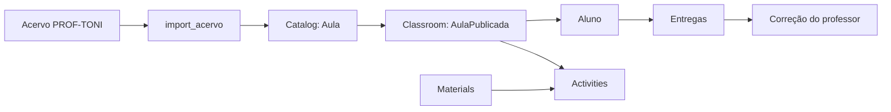
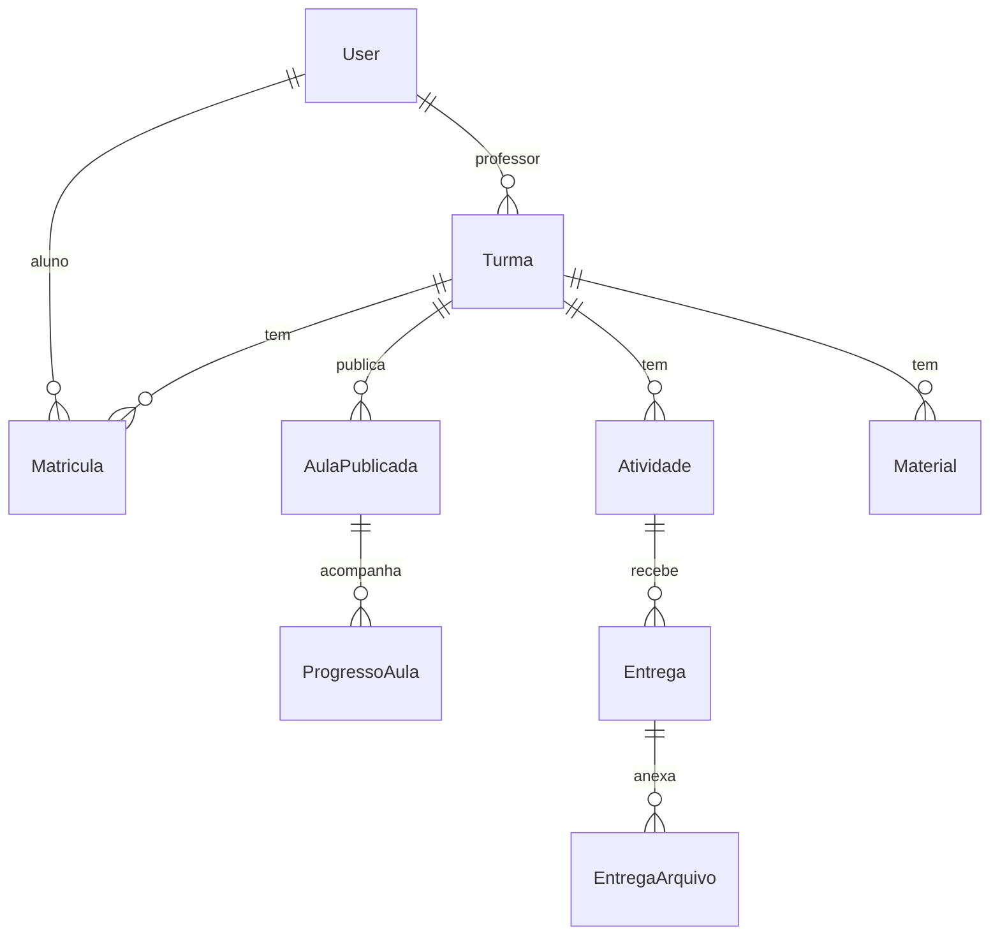

# Arquitetura

O projeto é single-tenant e segue apps Django por domínio, na raiz do repositório. O app `core` concentra configuração e URLs globais; `base` concentra recursos compartilhados; os apps de domínio implementam contas, catálogo, turmas, materiais e atividades.

## Apps

| App | Responsabilidade |
|---|---|
| `accounts` | Usuário custom, login por e-mail e perfis de professor/aluno. |
| `catalog` | Taxonomia e aulas canônicas importadas do acervo. |
| `classroom` | Turmas, matrículas, aulas publicadas e progresso. |
| `materials` | Materiais extras com download protegido. |
| `activities` | Atividades, entregas, anexos e correção. |
| `base` | Model base, storage protegido e comandos transversais. |

## Regras de segurança

Arquivos de materiais e entregas usam storage protegido fora de `MEDIA_ROOT`. O acesso passa por views com checagem de permissão: professor dono da turma, aluno matriculado ou admin.

## Modelo resumido

